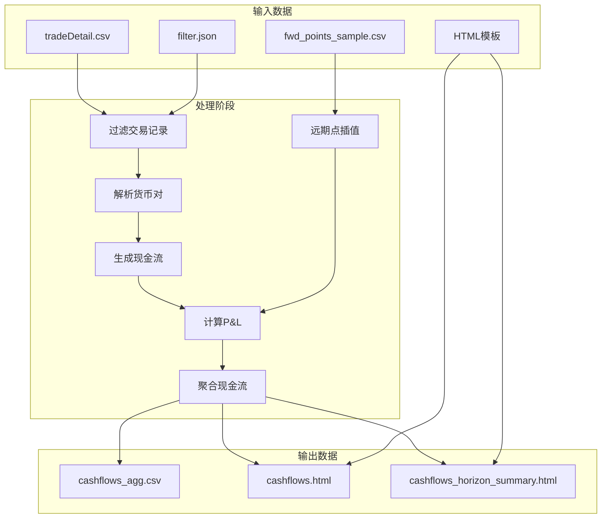

# 外汇交易现金流转换工具 - 需求文档

## 1. 项目概述

### 1.1 功能简介
本工具用于从外汇交易明细数据中提取、计算并汇总现金流，生成可用于风险分析和资金规划的现金流报告。支持多种外汇交易类型（Spot/FX Swap/Outright Forward），并可根据远期点表进行损益计算。

### 1.2 技术栈
- **编程语言**: Python 3
- **依赖库**:
  - 标准库: `csv`, `json`, `argparse`, `datetime`, `decimal`, `pathlib`, `typing`
  - 自定义模块: `points_interpolator`（远期点插值模块）
- **输入编码**: UTF-8 with BOM (utf-8-sig)
- **输出格式**: CSV, HTML

---

## 2. 输入数据规范

### 2.1 交易明细文件 (tradeDetail.csv)

| 字段名 | 必填 | 数据类型 | 说明 |
|--------|------|----------|------|
| Deal Id | ✅ | 字符串 | 交易唯一标识，格式: `VAL_IMP:数字` |
| Cpty. | ✅ | 字符串 | 交易对手方简称 |
| Type of Deal | ✅ | 枚举 | 交易类型：FX Swap / Spot / Outright Forward |
| Folder | ✅ | 字符串 | 交易组合/文件夹名称（用于过滤） |
| Security | ✅ | 字符串 | 货币对，格式：`货币1/货币2` |
| Amount1 | ✅ | 数值 | 标的货币金额（可为负数） |
| Amount2 | ✅ | 数值 | 计价货币金额（可为负数） |
| Trade Date | ✅ | 日期 | 交易日期，格式：`DD/MM/YYYY` |
| Value Date | ✅ | 日期 | 起息日/近端交割日，格式：`DD/MM/YYYY` |
| Mat. Date | | 日期 | 远端到期日，格式：`DD/MM/YYYY` |
| User | | 字符串 | 交易员/用户名称 |
| Type | | 字符串 | 交易类型细分 |
| Rate/Price | | 数值 | 汇率/远期点数 |
| Quantity | | 数值 | 数量 |
| Comments | | 字符串 | 备注信息 |
| Option Type | | 字符串 | 期权类型 |
| Strike | | 数值 | 执行价格 |
| Last Date | | 日期 | 最后日期 |

### 2.2 远期点报表文件 (fwd_points_sample.csv)

#### 2.2.1 文件格式
```
<货币对>
Tenor,SettlementDate,BidPoints,AskPoints,BidOutright,AskOutright
<Tenor>,<结算日>,<买方点数>,<卖方点数>,<买方远期价>,<卖方远期价>
```

#### 2.2.2 期限标识 (Tenor)
| 标识 | 含义 | 说明 |
|------|------|------|
| ON | Overnight | 次日交割 |
| TN | Tomorrow Next | 交易日后第二个营业日 |
| SP | Spot | 即期交割 |
| SN | Spot Next | 即期后第一个营业日 |
| 1W | 1 Week | 1周 |
| 1M | 1 Month | 1个月 |
| 2M | 2 Months | 2个月 |
| ... | ... | ... |
| 5Y | 5 Years | 5年 |

#### 2.2.3 数据示例
```csv
EURUSD
Tenor,SettlementDate,BidPoints,AskPoints,BidOutright,AskOutright
ON,2025/12/31,0.595,0.645,1.1772357,1.1773506
SP,2026/1/2,1.1775,1.1776,1.1775,1.1776
1M,2026/2/2,17.39,17.54,1.179239,1.179354
```

### 2.3 过滤配置文件 (filter.json)

```json
{
    "ignore_folders": ["JSH_SWPPOS", "ZF-FXSWAP"]
}
```

---

## 3. 核心转换规则

### 3.1 现金流生成规则

#### 3.1.1 Spot（即期交易）
**现金流**:
- 近端 (Value Date): `Amount1 + Amount2`

| 日期 | 货币 | 金额 |
|------|------|------|
| Value Date | CCY1 | Amount1 |
| Value Date | CCY2 | Amount2 |

#### 3.1.2 FX Swap（外汇掉期）
**现金流**:
- 近端 (Value Date): `Amount1 + Amount2`
- 远端 (Mat. Date): `-Amount1 + (-Amount1 × far_rate)`

| 日期 | 货币 | 金额 |
|------|------|------|
| Value Date | CCY1 | Amount1 |
| Value Date | CCY2 | Amount2 |
| Mat. Date | CCY1 | -Amount1 |
| Mat. Date | CCY2 | Amount1 × far_rate |

**近端汇率计算**:
```
near_rate = abs(Amount2 / Amount1)
```
**远端汇率计算**:
```
far_rate = near_rate + (points / divisor)
```

其中 `divisor` 取决于基准货币：
- JPY 基准 (如 JPY/CNY): `divisor = 1000000`
- 非 JPY 基准 (如 USD/CNY, EUR/USD): `divisor = 10000`

其中 'points' 取决于远期点报表文件里的设置：
- 如果存在该远期点，则使用它进行插值计算
- 如果不存在该远期点，则使用交易明细中的Rate/Price字段

#### 3.1.3 Outright Forward（远期交易）
**现金流**:
- 远端 (Mat. Date): `Amount1 + Amount2`

| 日期 | 货币 | 金额 |
|------|------|------|
| Mat. Date | CCY1 | Amount1 |
| Mat. Date | CCY2 | Amount2 |

### 3.2 损益计算规则

#### 3.2.1 P&L 计算公式
```python
pnl = -amt1 × (curve_pts - pts) / divisor
```
- `amt1`: 标的货币金额（Amount1）
- `curve_pts`: 曲线插值的远期点数
- `pts`: 交易记录中的 Rate/Price
- `divisor`: 货币对除数

#### 3.2.2 P&L 归属
损益归属到计价货币（CCY2），因为 `Amount2` 是以 CCY2 计价。

### 3.3 数据处理规则

#### 3.3.1 货币对解析
```python
parse_pair(pair: str) -> Tuple[str, str]
```
- 格式：`货币1/货币2`
- 转换为大写

```python
is_jpy_base(pair: str) -> bool
```
- 判断货币对是否以 JPY 为基础货币

#### 3.3.2 数值处理
```python
parse_decimal(s: str) -> Decimal
```
- 移除千分位逗号
- 使用 `Decimal` 避免浮点精度问题

```python
normalize_cashflow(ccy: str, amt: Decimal) -> Decimal
```
- JPY 金额取整到个位
- 其他货币保持原精度

#### 3.3.3 日期处理
```python
parse_date_safe(s: str) -> Optional[datetime.date]
```
- 格式: `DD/MM/YYYY`
- 无效日期返回 `None`

### 3.4 远期点插值规则

#### 3.4.1 插值逻辑 (`points_interpolator`)
- **期限计算**：使用当前日期（或起息日，取较晚者）到到期日 (Mat. Date) 的营业日天数作为期限
- **动态调整**：随着时间推移，同一笔 Swap 的期限会从原始天数逐渐缩短，点数随时间动态变化
- **匹配期限**：根据计算出的期限查找匹配的期限标识 (Tenor)
- **线性插值**：如果期限落在两个期限标识之间，使用线性插值计算点值
- **回退机制**：插值失败时使用交易明细中的 Rate/Price 字段

#### 3.4.2 除数规则 (`points_divisor_by_pair`)
| 货币对类型 | 除数 |
|-----------|------|
| JPY 基准 (如 JPY/CNY) | 1000000 |
| 非 JPY 基准 (如 USD/CNY, EUR/USD, USD/JPY) | 10000 |

---

## 4. 输出数据规范

### 4.1 聚合现金流 CSV (cashflows_agg.csv)

| 字段 | 数据类型 | 说明 |
|------|----------|------|
| Date | 日期 | 现金流日期 |
| Currency | 字符串 | 货币代码 |
| Cashflow | 数值 | 聚合后的现金流金额 |

### 4.2 现金流 HTML 报告

#### 4.2.1 基础模板 (template.html)
- 显示所有现金流记录
- 包含日期过滤功能（默认过滤今天及之前的记录）

#### 4.2.2 期限汇总模板 (template_horizon_summary.html)
- 包含以下数据：
  - `cashflows`: 现金流明细
  - `pnl`: 按货币统计的损益
  - `fx_rates`: 即期汇率（用于 CNY 折算）

---

## 5. 功能特性

### 5.1 文件夹过滤
- **功能**: 忽略指定 Folder 的交易
- **配置方式**:
  - 命令行: `--ignore_folders "JSH_SWPPOS,ZF-FXSWAP"`
  - 配置文件: `--filter_config filter.json`
  - 优先级: 命令行 > 配置文件

### 5.2 远期点插值
- **功能**: 根据期限表插值计算远期点数
- **输入**: `--points_csv <文件路径>`
- **回退**: 插值失败时使用交易明细中的 Rate/Price

### 5.3 即期汇率提取
- **来源**: 从远期点报表中提取 SP（Spot）期限的汇率
- **用途**: CNY 货币折算

---

## 6. 使用方式

### 6.1 命令行参数

```bash
python cashflow_convertor_standard.py \
    --input <交易明细CSV> \
    --template <HTML模板> \
    --out_csv <输出CSV> \
    --out_html <输出HTML> \
    --template_summary <期限汇总模板> \
    --out_html_summary <期限汇总HTML> \
    --out_dir <输出目录> \
    --ignore_folders <忽略文件夹> \
    --filter_config <过滤配置JSON> \
    --points_csv <远期点报表CSV>
```

### 6.2 参数说明

| 参数 | 默认值 | 说明 |
|------|--------|------|
| `--input` | 必填 | 交易明细 CSV 文件路径 |
| `--template` | `template.html` | HTML 模板文件路径 |
| `--out_csv` | `cashflows_agg.csv` | 聚合现金流输出文件名 |
| `--out_html` | `cashflows.html` | 现金流 HTML 输出文件名 |
| `--template_summary` | `template_horizon_summary.html` | 期限汇总 HTML 模板 |
| `--out_html_summary` | `cashflows_horizon_summary.html` | 期限汇总 HTML 输出 |
| `--out_dir` | `generatedFile` | 输出目录 |
| `--ignore_folders` | 空 | 忽略的文件夹列表（逗号分隔） |
| `--filter_config` | 空 | 过滤规则 JSON 文件 |
| `--points_csv` | 空 | 远期点报表 CSV 路径 |

### 6.3 使用示例

```bash
# 基础用法
python cashflow_convertor_standard.py \
    --input dataSource/tradeDetail.csv

# 完整参数
python cashflow_convertor_standard.py \
    --input dataSource/tradeDetail.csv \
    --points_csv dataSource/fwd_points_sample.csv \
    --ignore_folders "JSH_SWPPOS,ZF-FXSWAP" \
    --filter_config filter.json \
    --out_dir generatedFile
```

---

## 7. 数据流图



---

## 8. 错误处理

### 8.1 必需字段缺失
- `Mat. Date` 缺失（Outright Forward）
- `Mat. Date` 缺失（FX Swap）
- `Amount1` 为零（FX Swap）

### 8.2 文件未找到
- 过滤配置文件不存在
- 远期点报表不存在

### 8.3 配置格式错误
- `filter_config.ignore_folders` 必须为列表

---

## 9. 测试用例

### 9.1 Spot 交易现金流
**输入**:
```csv
Deal Id,Type of Deal,Security,Amount1,Amount2,Value Date
VAL_IMP:7750129,Spot,JPY/CNY,1200000,-53980.8,25/12/2025
```

**输出**:
| Date | Currency | Cashflow |
|------|----------|----------|
| 25/12/2025 | JPY | 1200000 |
| 25/12/2025 | CNY | -53980.8 |

### 9.2 FX Swap 交易现金流
**输入**:
```csv
Deal Id,Type of Deal,Security,Amount1,Amount2,Value Date,Mat. Date,Rate/Price
VAL_IMP:2016522,FX Swap,USD/CNY,-100000000,701070000,29/12/2025,30/12/2025,-0.5
```

**输出**:
| Date | Currency | Cashflow |
|------|----------|----------|
| 29/12/2025 | USD | -100000000 |
| 29/12/2025 | CNY | 701070000 |
| 30/12/2025 | USD | 100000000 |
| 30/12/2025 | CNY | -701070000 |

### 9.3 P&L 计算
**输入**:
- 交易点数: `-0.5`
- 曲线点数: `-0.6`（插值结果）
- Amount1: `-100000000`

**计算**:
```
pnl = -(-100000000) × (-0.6 - (-0.5)) / 10000
    = 100000000 × (-0.1) / 10000
    = -1000 CNY
```

---

## 10. 附录

### 10.1 支持的交易类型
| 交易类型 | 英文标识 | 现金流特征 |
|----------|----------|----------|
| 即期交易 | Spot | 单时点、双货币 |
| 外汇掉期 | FX Swap | 双时点、双货币、金额相反 |
| 远期交易 | Outright Forward | 单时点（远端）、双货币 |

### 10.2 除数对照表
| 货币对示例 | 基准货币 | 除数 |
|------------|----------|------|
| JPY/CNY | JPY | 1000000 |
| USD/CNY | CNY | 10000 |
| EUR/USD | USD | 10000 |
| USD/JPY | JPY | 10000 |

### 10.3 版本信息
- **当前版本**: 1.1
- **更新日期**: 2026-02-02
- **作者**: Meituan FX Team
